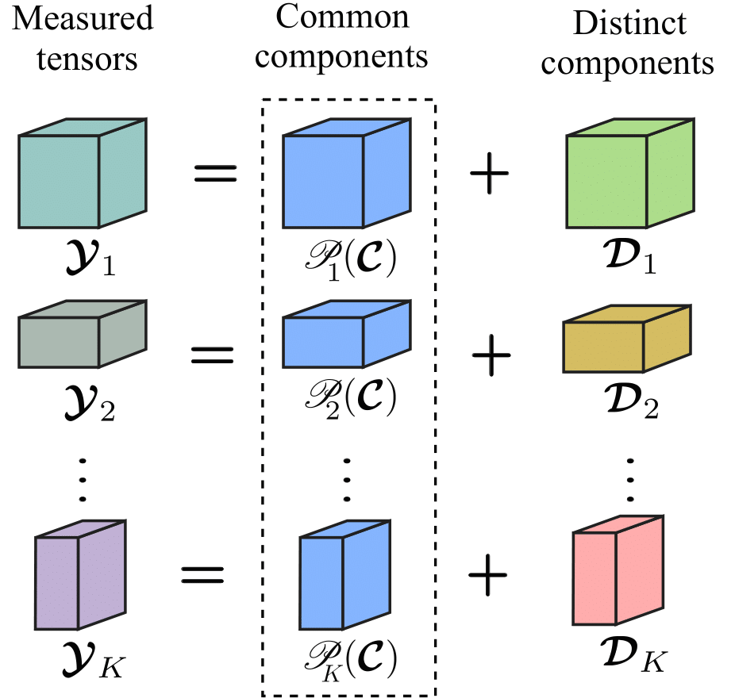
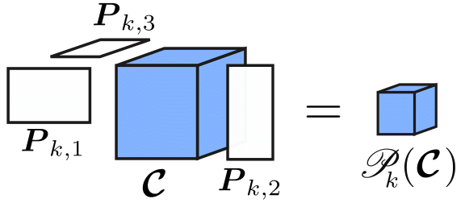

# Personalized Coupled Tensor Decomposition for Multimodal Data Fusion: Uniqueness and Algorithms (PeCoTeD)

This package contains the authors' implementation of the personalized coupled tensor decomposition method presented in the paper:

    [1] Personalized Coupled Tensor Decomposition for Multimodal Data Fusion: Uniqueness and Algorithms
        R.A. Borsoi, K. Usevich, D. Brie, T. Adali
        IEEE Transactions on Signal Processing, 2024.

*Summary:* Coupled tensor decompositions (CTDs) perform
data fusion by linking factors from different datasets. However, current CTDs do
not address important challenges of data fusion, where: 1) the
datasets are often heterogeneous, constituting different “views”
of a given phenomena (multimodality); and 2) each dataset can
contain personalized or dataset-specific information, constituting
distinct factors that are not coupled with other datasets. In this
work, we introduce a personalized CTD framework tackling these
challenges. A flexible model is proposed where each dataset is
represented as the sum of two components, one related to a
common tensor through a multilinear measurement model, and
another specific to each dataset. Both the common and distinct
components are assumed to admit a polyadic decomposition.
This generalizes several existing CTD models. We provide con-
ditions for specific and generic uniqueness of the decomposition
that are easy to interpret. Two algorithms are proposed to compute
the common and distinct components: a semi-algebraic one and
a coordinate-descent optimization method.

	

Illustration of the model considered in paper [1]. A latent tensor C is common in all 
measurements and acquired through an operator Pk while tensors Dk are distinct to each 
measurement, leading to a personalized decomposition. The second figure is an illustration 
of the multilinear measurement/degradation model.

## IMPORTANT

If you use this software please cite the paper [1] in any resulting publication.

## MINIMAL REQUIREMENTS & RUNNING

In order to run the demos, you will have to
1.  Download and install Tensorlab 3.0: https://www.tensorlab.net
2.  This code also uses the freeLYAP and YALMIP packages, which are already provided in the repository. See the comments below.

Then, just start MATLAB and run one of the demo scripts (e.g. main_synthetic.m, etc).

## NOTES:
1.  Codes for the generalized sylvester equation solver were generously provided by Alex Townsend, in [this toolbox](https://github.com/ajt60gaibb/freeLYAP).
2.  Codes for the YALMIP package were generously provided by Johan Löfberg, and is supplied [here](https://yalmip.github.io/)

